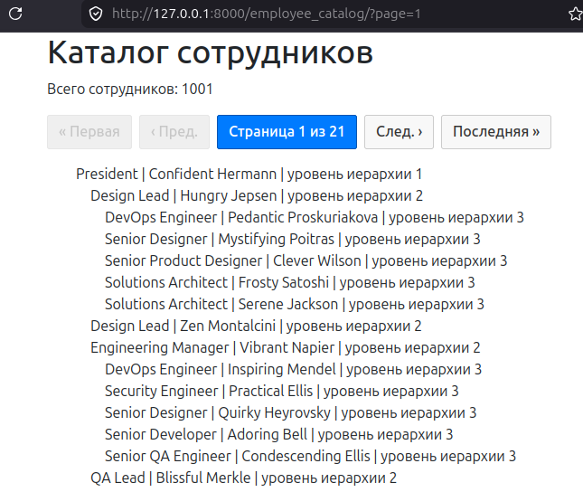
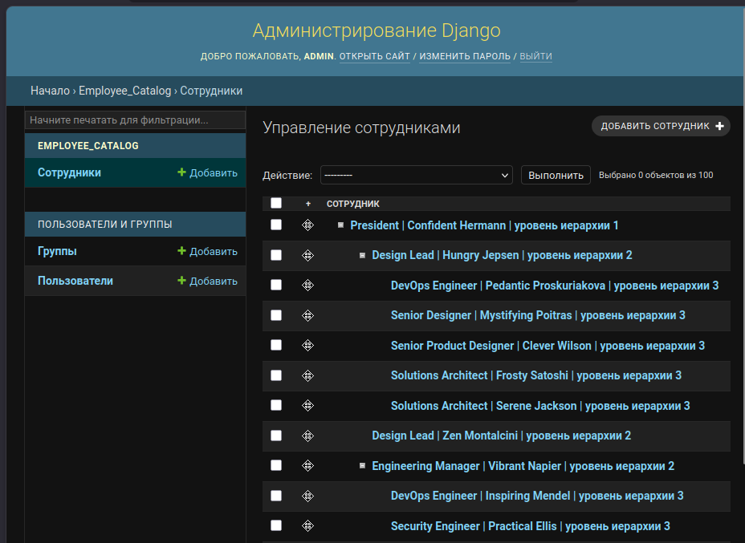
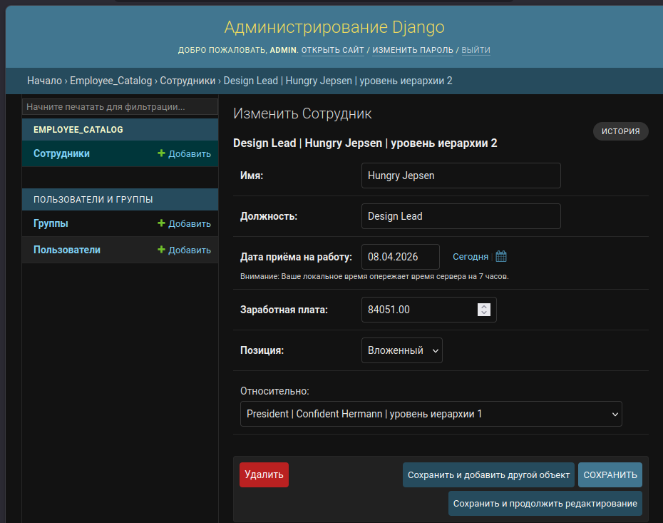

# Employee Catalog Django App

Веб-приложение на базе Django для иерархического учета, каталогизации и менеджмента сотрудников организации. Проект разработан с акцентом на чистую архитектуру, масштабируемость и возможность параллельной интеграции с асинхронными фреймворками.

## Функциональность и архитектура

- **Управление каталогом:** Полноценный CRUD для управления карточками сотрудников, должностями и департаментами.
- **Иерархическая структура:** Моделирование организационной структуры компании с поддержкой связей между менеджерами и подчиненными.
- **Интеграция с API (В разработке):** Параллельное проектирование высокопроизводительного модуля на **FastAPI** для асинхронного чтения и отдачи данных каталога, что позволяет снизить нагрузку на основное Django-приложение.
- **ORM & Безопасность:** Использование встроенного Django ORM, миграций и системы разграничения прав доступа.

## Технологический стек

- **Backend:** Python 3, Django, FastAPI (модуль в разработке)
- **База данных:** SQLite / PostgreSQL (с поддержкой миграций через Django ORM)
- **Инструменты:** Git (многоветочная структура разработки), Роутинг, Моделирование данных.

## Структура веток (Git Branching)
Разработка проекта ведется по методологии компонентного ветвления для изоляции фич:
- `main` — стабильная базовая версия приложения на Django.
- Прочие ветки содержат изолированную разработку модулей, включая интеграцию асинхронного API на FastAPI.

## Скриншоты






## Установка и запуск

1. Клонируйте репозиторий:
   ```bash
   git clone https://github.com
   cd employee_catalog_django_app
   ```

2. Создайте и активируйте виртуальное окружение:
   ```bash
   python3 -m venv .venv
   source .venv/bin/activate  # Для Linux/macOS
   # .venv\Scripts\activate  # Для Windows
   ```

3. Установите зависимости и выполните миграции:
   ```bash
   pip install -r requirements.txt
   python manage.py migrate
   ```

4. Запустите локальный сервер:
   ```bash
   python manage.py runserver
   ```
   Приложение будет доступно по адресу `http://127.0.0.1:8000/`.

## Лицензия
MIT License | 2026 | Dmitrii Pivnev
